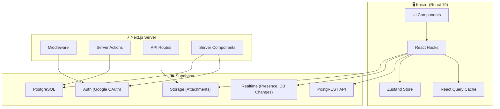
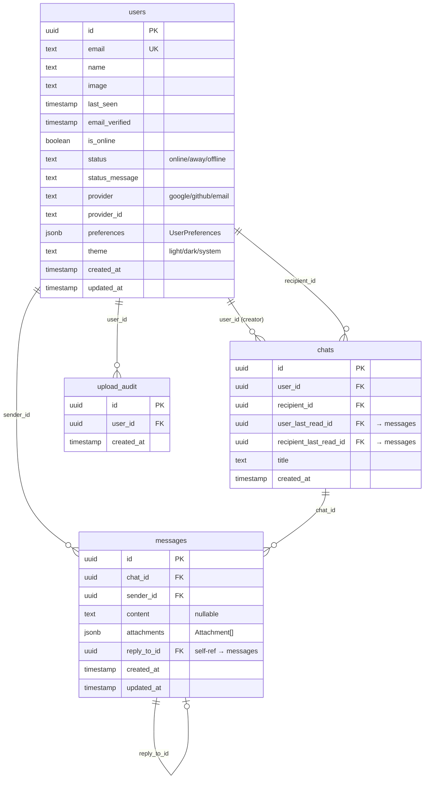
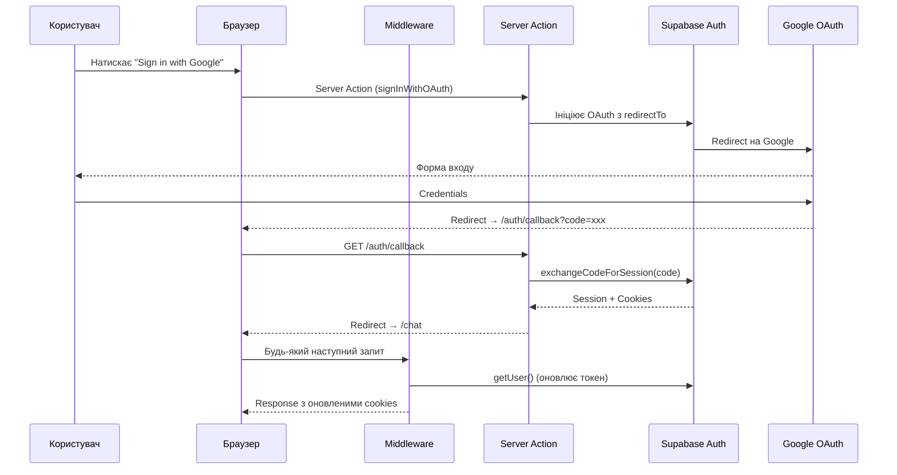
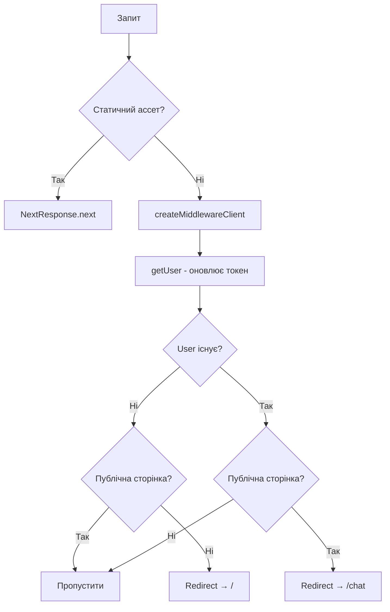
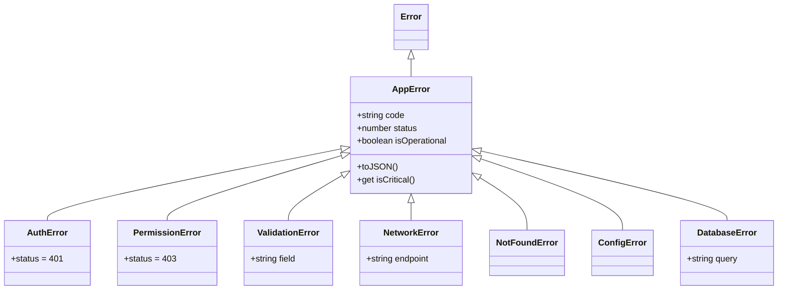
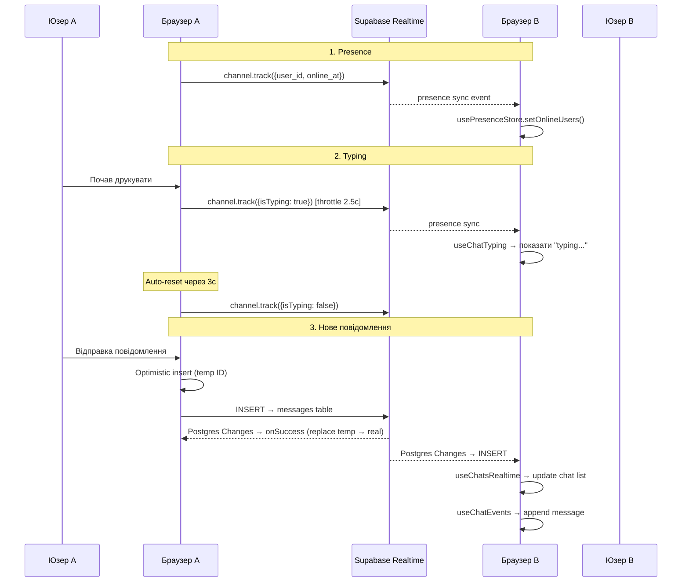

# 🗺️ Trace — Повна технічна карта проекту

> **Trace** — це сучасний real-time месенджер побудований на Next.js 16 + Supabase.
> Підтримує приватні чати, вкладення файлів, live presence, typing indicators та optimistic UI.

---

## 📦 Стек технологій

| Категорія | Технологія | Версія | Роль |
|-----------|-----------|--------|------|
| **Фреймворк** | Next.js (App Router) | 16.1.6 | SSR/SSG, маршрутизація, middleware |
| **UI** | React | 19.2.3 | Рендеринг інтерфейсу |
| **Мова** | TypeScript | 5.x | Типізація |
| **БД ORM** | Drizzle ORM | 0.45.1 | SQL-генерація, міграції (Server Actions) |
| **БД Driver** | postgres.js | 3.4.8 | Підключення до PostgreSQL |
| **BaaS** | Supabase | 2.91.0 | Auth, Realtime, Storage, REST API |
| **State (Client)** | Zustand | 5.0.10 | Глобальний стан (Presence) |
| **Data Fetching** | TanStack React Query | 5.90.20 | Кешування, infinite queries, mutations |
| **Валідація** | Zod | 4.3.6 | Runtime-валідація + типи |
| **Стилізація** | TailwindCSS | 4.1.18 | Утилітарний CSS |
| **Анімація** | Framer Motion | 12.29.0 | UI-анімації |
| **UI бібліотека** | Radix UI | latest | Accessible примітиви |
| **Лінтер** | Biome + ESLint | latest | Форматування та перевірка коду |
| **Пакетний менеджер** | pnpm | — | Управління залежностями |
| **Контейнеризація** | Docker + docker-compose | — | Dev/Prod оточення |

---

## 🏗️ Архітектура високого рівня



---

## 📁 Структура проекту

```
Trace/
├── drizzle/                    # SQL міграції (Drizzle Kit)
│   ├── 0000_flat_grandmaster.sql
│   ├── 0001_pretty_whiplash.sql
│   ├── 0002_panoramic_vulcan.sql
│   ├── 0003_burly_ultron.sql
│   ├── 0003_equal_victor_mancha.sql
│   ├── 0004_message_content_constraints.sql
│   └── meta/
├── scripts/
│   └── test-rate-limit.ts      # Тестовий скрипт rate limiting
├── docs/
│   └── OPTIMISTIC_UI_GUIDE.md  # Документація по optimistic UI
├── supabase/
│   ├── config.toml             # Конфігурація Supabase
│   └── migrations/             # Supabase міграції
├── src/
│   ├── middleware.ts            # ★ Next.js Edge Middleware
│   ├── wdyr.ts                 # Why-Did-You-Render (dev only)
│   ├── app/                    # Next.js App Router
│   ├── actions/                # Server Actions
│   ├── components/             # React компоненти
│   ├── config/                 # Конфігурації
│   ├── db/                     # Drizzle ORM (schema + connection)
│   ├── hooks/                  # React хуки
│   ├── lib/                    # Утиліти та клієнти
│   ├── services/               # API-сервіси (Supabase client calls)
│   ├── shared/                 # Спільний код (errors, error handler)
│   ├── store/                  # Zustand stores
│   └── types/                  # TypeScript типи
├── drizzle.config.ts           # Конфігурація Drizzle Kit
├── next.config.ts              # Конфігурація Next.js
├── biome.json                  # Конфігурація Biome
├── Dockerfile                  # Docker image
└── docker-compose.yml          # Docker Compose
```

---

## 🗄️ База даних (PostgreSQL + Drizzle ORM)

### Схема: [schema.ts](file:///c:/Users/f4u4b_000/OneDrive/Desktop/Projects/Trace/src/db/schema.ts)



### Індекси

| Таблиця | Індекс | Поля | Призначення |
|---------|--------|------|-------------|
| `users` | `idx_user_email` | `email` | Швидкий пошук по email |
| `users` | `idx_user_provider` | `provider, provider_id` | OAuth lookup |
| `users` | `idx_user_last_seen` | `last_seen` | Сортування за активністю |
| `chats` | `idx_chats_users` | `user_id, recipient_id` | Пошук чатів користувача |
| `messages` | `idx_messages_chat_created` | `chat_id, created_at` | **КРИТИЧНО**: рендер чату + сортування |
| `messages` | `idx_messages_sender` | `sender_id` | Пошук по відправнику |
| `upload_audit` | `idx_upload_audit_user_time` | `user_id, created_at` | Rate limiting аудит |

### З'єднання з БД: [db/index.ts](file:///c:/Users/f4u4b_000/OneDrive/Desktop/Projects/Trace/src/db/index.ts)

```typescript
const client = postgres(process.env.DATABASE_URL!);
export const db = drizzle(client, { schema });
```

> [!IMPORTANT]
> Drizzle ORM використовується **ТІЛЬКИ** в Server Actions (серверний код). На клієнті всі запити йдуть через Supabase PostgREST API.

---

## 🔐 Автентифікація (Supabase Auth + Google OAuth)

### Потік автентифікації



### Ключові файли

| Файл | Роль | Середовище |
|------|------|-----------|
| [lib/supabase/client.ts](file:///c:/Users/f4u4b_000/OneDrive/Desktop/Projects/Trace/src/lib/supabase/client.ts) | **Singleton** Supabase клієнт для браузера. Інтерцептор [fetch](file:///c:/Users/f4u4b_000/OneDrive/Desktop/Projects/Trace/src/lib/supabase/client.ts#19-45) для глобальної обробки помилок + toast. | Client |
| [lib/supabase/server.ts](file:///c:/Users/f4u4b_000/OneDrive/Desktop/Projects/Trace/src/lib/supabase/server.ts) | Supabase клієнт для серверних компонентів. Кешується через `React.cache()` — синглтон в рамках запиту. | Server |
| [lib/supabase/middleware.ts](file:///c:/Users/f4u4b_000/OneDrive/Desktop/Projects/Trace/src/lib/supabase/middleware.ts) | Суpabase клієнт для middleware. Оновлює cookies в request і response. | Edge |
| [lib/auth.ts](file:///c:/Users/f4u4b_000/OneDrive/Desktop/Projects/Trace/src/lib/auth.ts) | Клієнтські функції [handleSignIn()](file:///c:/Users/f4u4b_000/OneDrive/Desktop/Projects/Trace/src/lib/auth.ts#7-20) / [handleSignOut()](file:///c:/Users/f4u4b_000/OneDrive/Desktop/Projects/Trace/src/lib/auth.ts#21-47). Оновлює `last_seen` перед виходом. | Client |
| [components/auth/AuthProvider.tsx](file:///c:/Users/f4u4b_000/OneDrive/Desktop/Projects/Trace/src/components/auth/AuthProvider.tsx) | React Context Provider. Нормалізує Supabase User → [AppUser](file:///c:/Users/f4u4b_000/OneDrive/Desktop/Projects/Trace/src/types/auth.ts#7-24). Слухає `onAuthStateChange`. | Client |
| [app/auth/callback/route.ts](file:///c:/Users/f4u4b_000/OneDrive/Desktop/Projects/Trace/src/app/auth/callback/route.ts) | API Route для OAuth callback. Виконує `exchangeCodeForSession(code)`. | Server |

### AuthContext API

```typescript
interface AuthContextType {
  user: AppUser | null;          // Нормалізований користувач
  supabaseUser: SupabaseUser | null; // Оригінальний Supabase User
  loading: boolean;
  supabase: SupabaseClient;
  refreshUser: () => Promise<void>;
}
```

### Тип AppUser: [types/auth.ts](file:///c:/Users/f4u4b_000/OneDrive/Desktop/Projects/Trace/src/types/auth.ts)

```typescript
interface AppUser {
  id: string;
  email: string;
  email_confirmed_at?: string;
  phone?: string;
  user_metadata: UserMetadata;
  name: string | null;           // З БД (пріоритет) або OAuth
  image: string | null;          // З БД або OAuth
  last_seen: string | null;
  is_online: boolean;            // Обчислюється: last_seen < 5 хвилин
  display_name: string;          // Обчислюється: metadata.name || dbUser.name || email
}
```

### UserUtils (клас утиліт)

| Метод | Призначення |
|-------|------------|
| [normalize(supabaseUser, dbUser?)](file:///c:/Users/f4u4b_000/OneDrive/Desktop/Projects/Trace/src/types/auth.ts#37-58) | Поєднує Supabase Auth + DB дані |
| [getDisplayName(supabaseUser, dbUser?)](file:///c:/Users/f4u4b_000/OneDrive/Desktop/Projects/Trace/src/types/auth.ts#59-70) | Повертає найкраще ім'я |
| [getUserImage(supabaseUser, dbUser?)](file:///c:/Users/f4u4b_000/OneDrive/Desktop/Projects/Trace/src/types/auth.ts#71-76) | Повертає аватар |
| [isUserOnline(lastSeen?)](file:///c:/Users/f4u4b_000/OneDrive/Desktop/Projects/Trace/src/types/auth.ts#81-88) | Перевірка "онлайн" (< 5 хв.) |
| [getInitials(name)](file:///c:/Users/f4u4b_000/OneDrive/Desktop/Projects/Trace/src/types/auth.ts#89-97) | Перші 2 літери для аватара |

---

## 🛡️ Middleware: [middleware.ts](file:///c:/Users/f4u4b_000/OneDrive/Desktop/Projects/Trace/src/middleware.ts)

### Логіка



### Матчер (яких URL стосується)
```
/((?!api|_next/static|_next/image|_next/data|favicon.ico|.*\.(?:svg|png|jpg|jpeg|gif|webp)$).*)
```

> [!NOTE]
> Middleware перед кожним запитом перевіряє/оновлює Supabase Auth токен через cookies. Це ключовий механізм SSR-авторизації.

---

## ⚡ Server Actions: [actions/chat-actions.ts](file:///c:/Users/f4u4b_000/OneDrive/Desktop/Projects/Trace/src/actions/chat-actions.ts)

> [!IMPORTANT]
> Server Actions використовують **Drizzle ORM** для прямого доступу до PostgreSQL. Це єдине місце, де код працює напряму з БД через `db` instance.

| Action | Опис | Захист |
|--------|------|--------|
| [getOrCreateChatAction(targetUserId)](file:///c:/Users/f4u4b_000/OneDrive/Desktop/Projects/Trace/src/actions/chat-actions.ts#54-135) | Знаходить існуючий чат або створює новий. Після успіху робить `redirect(/chat/{id})`. | Zod UUID валідація, Rate Limit 5/хв, захист від чату із самим собою |
| [markAsReadAction(chatId, messageId)](file:///c:/Users/f4u4b_000/OneDrive/Desktop/Projects/Trace/src/actions/chat-actions.ts#136-186) | Оновлює `user_last_read_id` або `recipient_last_read_id` в чаті. | Zod валідація, Rate Limit 10/хв, перевірка учасника |

### Допоміжні функції

| Функція | Опис |
|---------|------|
| [getCurrentUser()](file:///c:/Users/f4u4b_000/OneDrive/Desktop/Projects/Trace/src/actions/chat-actions.ts#22-53) | Отримує Supabase User через SSR клієнт. Використовує [getUser()](file:///c:/Users/f4u4b_000/OneDrive/Desktop/Projects/Trace/src/types/auth.ts#71-76) (надійніший за `getSession()`). |

---

## 🔌 Сервіси (Services Layer)

> Сервісний шар — це абстракція над Supabase Client API. Кожен сервіс групує операції однієї доменної області.

### [services/chat/chats.service.ts](file:///c:/Users/f4u4b_000/OneDrive/Desktop/Projects/Trace/src/services/chat/chats.service.ts) — `chatsApi`

| Метод | Опис | Деталі |
|-------|------|--------|
| [getChats(userId, page, limit)](file:///c:/Users/f4u4b_000/OneDrive/Desktop/Projects/Trace/src/services/chat/chats.service.ts#7-53) | Список чатів з last message, user і recipient | Пагінація, сортування за останнім повідомленням |
| [getChatsInfinite(userId, pageParam, limit)](file:///c:/Users/f4u4b_000/OneDrive/Desktop/Projects/Trace/src/services/chat/chats.service.ts#54-60) | Обгортка для infinite query | Делегує [getChats](file:///c:/Users/f4u4b_000/OneDrive/Desktop/Projects/Trace/src/services/chat/chats.service.ts#7-53) |
| [createChat(payload)](file:///c:/Users/f4u4b_000/OneDrive/Desktop/Projects/Trace/src/services/chat/chats.service.ts#61-78) | Створення чату | Повертає FullChat з user та recipient |
| [deleteChat(chatId)](file:///c:/Users/f4u4b_000/OneDrive/Desktop/Projects/Trace/src/services/chat/chats.service.ts#79-87) | Видалення чату | За ID |
| [updateChat(chatId, payload)](file:///c:/Users/f4u4b_000/OneDrive/Desktop/Projects/Trace/src/services/chat/chats.service.ts#88-108) | Оновлення чату | Встановлює `updated_at = now()` |

### [services/chat/messages.service.ts](file:///c:/Users/f4u4b_000/OneDrive/Desktop/Projects/Trace/src/services/chat/messages.service.ts) — `messagesApi`

| Метод | Опис | Деталі |
|-------|------|--------|
| [getMessages(chatId, cursor?)](file:///c:/Users/f4u4b_000/OneDrive/Desktop/Projects/Trace/src/services/chat/messages.service.ts#7-38) | Повідомлення чату | Cursor-based пагінація (50 шт.), включає `reply_to`, `sender`, `updated_at`. Reverse для Virtuoso |
| [sendMessage(chatId, payload)](file:///c:/Users/f4u4b_000/OneDrive/Desktop/Projects/Trace/src/services/chat/messages.service.ts#39-75) | Відправка повідомлення | З підтримкою attachments і reply_to |
| [deleteMessage(messageId, chatId)](file:///c:/Users/f4u4b_000/OneDrive/Desktop/Projects/Trace/src/services/chat/messages.service.ts#76-90) | Видалення | Потрібний chatId для доп. перевірки |
| [editMessage(messageId, content)](file:///c:/Users/f4u4b_000/OneDrive/Desktop/Projects/Trace/src/services/chat/messages.service.ts#91-105) | Редагування | Встановлює `updated_at` |
| [markAsRead(chatId, messageId, userId)](file:///c:/Users/f4u4b_000/OneDrive/Desktop/Projects/Trace/src/services/chat/messages.service.ts#106-118) | Позначити прочитаним | Вставляє в `message_reads` |

### [services/realtime/realtime.service.ts](file:///c:/Users/f4u4b_000/OneDrive/Desktop/Projects/Trace/src/services/realtime/realtime.service.ts) — `realtimeApi`

| Метод | Опис |
|-------|------|
| [createMessagesChannel()](file:///c:/Users/f4u4b_000/OneDrive/Desktop/Projects/Trace/src/services/realtime/realtime.service.ts#5-11) | Глобальний канал `messages:global` |
| [createChatChannel(chatId)](file:///c:/Users/f4u4b_000/OneDrive/Desktop/Projects/Trace/src/services/realtime/realtime.service.ts#11-17) | Канал конкретного чату `chat:{id}` |
| [subscribeToMessages(channel, cb)](file:///c:/Users/f4u4b_000/OneDrive/Desktop/Projects/Trace/src/services/realtime/realtime.service.ts#18-33) | Postgres Changes: table `messages` з фільтром по `chat_id` |
| [subscribeToAllMessages(channel, cb)](file:///c:/Users/f4u4b_000/OneDrive/Desktop/Projects/Trace/src/services/realtime/realtime.service.ts#34-48) | Postgres Changes: table `messages` без фільтру (RLS фільтрує) |
| [subscribeToTyping(channel, cb)](file:///c:/Users/f4u4b_000/OneDrive/Desktop/Projects/Trace/src/services/realtime/realtime.service.ts#49-55) | Broadcast: event `typing` |
| [subscribeToPresence(channel, cb)](file:///c:/Users/f4u4b_000/OneDrive/Desktop/Projects/Trace/src/services/realtime/realtime.service.ts#56-65) | Presence: sync, join, leave |
| [subscribeToChats(channel, cb)](file:///c:/Users/f4u4b_000/OneDrive/Desktop/Projects/Trace/src/services/realtime/realtime.service.ts#66-80) | Postgres Changes: table `chats` |
| [subscribeToUsers(channel, cb)](file:///c:/Users/f4u4b_000/OneDrive/Desktop/Projects/Trace/src/services/realtime/realtime.service.ts#81-96) | Postgres Changes: table `users` (UPDATE) |
| [broadcast(channel, event, payload)](file:///c:/Users/f4u4b_000/OneDrive/Desktop/Projects/Trace/src/services/realtime/realtime.service.ts#97-111) | Відправка broadcast |
| [trackPresence(channel, state)](file:///c:/Users/f4u4b_000/OneDrive/Desktop/Projects/Trace/src/services/realtime/realtime.service.ts#112-118) | Track стану presence |
| [subscribe(channel)](file:///c:/Users/f4u4b_000/OneDrive/Desktop/Projects/Trace/src/services/realtime/realtime.service.ts#119-125) / [unsubscribe(channel)](file:///c:/Users/f4u4b_000/OneDrive/Desktop/Projects/Trace/src/services/realtime/realtime.service.ts#126-132) | Управління підключенням |

### [services/storage/storage.service.ts](file:///c:/Users/f4u4b_000/OneDrive/Desktop/Projects/Trace/src/services/storage/storage.service.ts) — `storageApi`

| Метод | Опис |
|-------|------|
| [getPublicUrl(bucket, path, options?)](file:///c:/Users/f4u4b_000/OneDrive/Desktop/Projects/Trace/src/services/storage/storage.service.ts#15-36) | Public URL для публічних бакетів |
| [getSignedUrl(bucket, path, options?)](file:///c:/Users/f4u4b_000/OneDrive/Desktop/Projects/Trace/src/services/storage/storage.service.ts#37-72) | Signed URL для приватних бакетів (дефолт: 1 год) |
| [getUrl(bucket, path, options?)](file:///c:/Users/f4u4b_000/OneDrive/Desktop/Projects/Trace/src/hooks/useStorageUrl.ts#44-67) | **Auto-detect**: перевіряє [isPrivateBucket()](file:///c:/Users/f4u4b_000/OneDrive/Desktop/Projects/Trace/src/config/storage.config.ts#132-140) → signed або public |
| [uploadFile(bucket, path, file, options?)](file:///c:/Users/f4u4b_000/OneDrive/Desktop/Projects/Trace/src/services/storage/storage.service.ts#118-137) | Завантаження файлу |
| [uploadAttachment(file, chatId, userId)](file:///c:/Users/f4u4b_000/OneDrive/Desktop/Projects/Trace/src/services/storage/storage.service.ts#138-172) | Високорівневе завантаження: path = `{chatId}/{userId}/{timestamp}.{ext}`, визначає тип, формує [Attachment](file:///c:/Users/f4u4b_000/OneDrive/Desktop/Projects/Trace/src/types/index.ts#5-18) об'єкт |
| [getStorageConfig()](file:///c:/Users/f4u4b_000/OneDrive/Desktop/Projects/Trace/src/services/storage/storage.service.ts#173-188) | Fetch dynamic config з API `/api/storage/config` |

### [services/contacts/contacts.service.ts](file:///c:/Users/f4u4b_000/OneDrive/Desktop/Projects/Trace/src/services/contacts/contacts.service.ts) — `contactsApi`

| Метод | Опис |
|-------|------|
| [searchUsers(currentUserId, queryText)](file:///c:/Users/f4u4b_000/OneDrive/Desktop/Projects/Trace/src/services/contacts/contacts.service.ts#8-41) | Пошук користувачів. Якщо `queryText > 1 символ` — ILIKE по name/email (з sanitize). Інакше — top-20 by `last_seen`. |

### [services/user/user.service.ts](file:///c:/Users/f4u4b_000/OneDrive/Desktop/Projects/Trace/src/services/user/user.service.ts) — `userApi`

| Метод | Опис |
|-------|------|
| [updateLastSeen()](file:///c:/Users/f4u4b_000/OneDrive/Desktop/Projects/Trace/src/store/usePresenceStore.ts#45-48) | RPC `update_last_seen` (Supabase DB function) |

---

## 🪝 React Hooks

### Chat Hooks: [hooks/chat/](file:///c:/Users/f4u4b_000/OneDrive/Desktop/Projects/Trace/src/hooks/chat)

| Hook | Файл | Призначення | Деталі |
|------|------|------------|--------|
| [useChats](file:///c:/Users/f4u4b_000/OneDrive/Desktop/Projects/Trace/src/hooks/chat/useChatsRealtime.ts#45-170) | [useChats.ts](file:///c:/Users/f4u4b_000/OneDrive/Desktop/Projects/Trace/src/hooks/chat/useChats.ts) | Список чатів | React Query infinite query, key: `['chats']` |
| `useChatDetails` | [useChatDetails.ts](file:///c:/Users/f4u4b_000/OneDrive/Desktop/Projects/Trace/src/hooks/chat/useChatDetails.ts) | Деталі чату | Отримання конкретного чату з кешу |
| `useMessages` | [useMessages.ts](file:///c:/Users/f4u4b_000/OneDrive/Desktop/Projects/Trace/src/hooks/chat/useMessages.ts) | Повідомлення чату | Infinite query з cursor-pagination |
| [useSendMessage](file:///c:/Users/f4u4b_000/OneDrive/Desktop/Projects/Trace/src/hooks/chat/useSendMessage.ts#11-95) | [useSendMessage.ts](file:///c:/Users/f4u4b_000/OneDrive/Desktop/Projects/Trace/src/hooks/chat/useSendMessage.ts) | Відправка повідомлення | **Optimistic update**: temp ID → реальний ID після успіху |
| `useDeleteMessage` | [useDeleteMessage.ts](file:///c:/Users/f4u4b_000/OneDrive/Desktop/Projects/Trace/src/hooks/chat/useDeleteMessage.ts) | Видалення повідомлення | Mutation з оптимістичним видаленням |
| `useEditMessage` | [useEditMessage.ts](file:///c:/Users/f4u4b_000/OneDrive/Desktop/Projects/Trace/src/hooks/chat/useEditMessage.ts) | Редагування повідомлення | Mutation |
| `useMarkAsRead` | [useMarkAsRead.ts](file:///c:/Users/f4u4b_000/OneDrive/Desktop/Projects/Trace/src/hooks/chat/useMarkAsRead.ts) | Позначення прочитаного | Server Action based |
| `useDeleteChat` | [useDeleteChat.ts](file:///c:/Users/f4u4b_000/OneDrive/Desktop/Projects/Trace/src/hooks/chat/useDeleteChat.ts) | Видалення чату | Mutation |
| `useScrollToMessage` | [useScrollToMessage.ts](file:///c:/Users/f4u4b_000/OneDrive/Desktop/Projects/Trace/src/hooks/chat/useScrollToMessage.ts) | Прокрутка до повідомлення | Управління scroll позицією для Virtuoso |
| [useChatsRealtime](file:///c:/Users/f4u4b_000/OneDrive/Desktop/Projects/Trace/src/hooks/chat/useChatsRealtime.ts#45-170) | [useChatsRealtime.ts](file:///c:/Users/f4u4b_000/OneDrive/Desktop/Projects/Trace/src/hooks/chat/useChatsRealtime.ts) | Real-time оновлення списку чатів | Глобальна підписка на `messages` — оновлює last message |
| [useChatEvents](file:///c:/Users/f4u4b_000/OneDrive/Desktop/Projects/Trace/src/hooks/chat/useChatEvents.ts#9-110) | [useChatEvents.ts](file:///c:/Users/f4u4b_000/OneDrive/Desktop/Projects/Trace/src/hooks/chat/useChatEvents.ts) | Real-time events конкретного чату | Postgres Changes + Typing Presence для конкретного chatId |
| [useChatTyping](file:///c:/Users/f4u4b_000/OneDrive/Desktop/Projects/Trace/src/hooks/chat/useChatTyping.ts#12-86) | [useChatTyping.ts](file:///c:/Users/f4u4b_000/OneDrive/Desktop/Projects/Trace/src/hooks/chat/useChatTyping.ts) | "Користувач пише..." | Supabase Presence з throttle (2.5с) і auto-reset (3с) |
| `chats-cache` | [chats-cache.ts](file:///c:/Users/f4u4b_000/OneDrive/Desktop/Projects/Trace/src/hooks/chat/chats-cache.ts) | Утиліти для маніпуляції кешем | [upsertChatLastMessage](file:///c:/Users/f4u4b_000/OneDrive/Desktop/Projects/Trace/src/hooks/chat/chats-cache.ts#24-53), [updateChatMessageIfMatches](file:///c:/Users/f4u4b_000/OneDrive/Desktop/Projects/Trace/src/hooks/chat/chats-cache.ts#54-72), [mapChatsInfinite](file:///c:/Users/f4u4b_000/OneDrive/Desktop/Projects/Trace/src/hooks/chat/chats-cache.ts#11-23) |

### Contacts Hooks: [hooks/contacts/](file:///c:/Users/f4u4b_000/OneDrive/Desktop/Projects/Trace/src/hooks/contacts)

| Hook | Призначення |
|------|------------|
| `useSearchUsers` | React Query для пошуку контактів через `contactsApi.searchUsers` |

### User Hooks: [hooks/user/](file:///c:/Users/f4u4b_000/OneDrive/Desktop/Projects/Trace/src/hooks/user)

| Hook | Призначення |
|------|------------|
| [usePresence](file:///c:/Users/f4u4b_000/OneDrive/Desktop/Projects/Trace/src/store/usePresenceStore.ts#167-171) | Wrapper над presence store (onlineUsers set) |
| `useUpdateLastSeen` | Оновлення `last_seen` на сервері |

### Global/Utility Hooks

| Hook | Файл | Призначення |
|------|------|------------|
| [useGlobalRealtime](file:///c:/Users/f4u4b_000/OneDrive/Desktop/Projects/Trace/src/hooks/useGlobalRealtime.ts#7-28) | [useGlobalRealtime.ts](file:///c:/Users/f4u4b_000/OneDrive/Desktop/Projects/Trace/src/hooks/useGlobalRealtime.ts) | Ініціалізація Presence (викликається в AuthProvider) |
| [useDebouncedSearch](file:///c:/Users/f4u4b_000/OneDrive/Desktop/Projects/Trace/src/hooks/useDebouncedSearch.ts#4-63) | [useDebouncedSearch.ts](file:///c:/Users/f4u4b_000/OneDrive/Desktop/Projects/Trace/src/hooks/useDebouncedSearch.ts) | Debounce + Zod санітизація пошуку (300ms) |
| [useOptimisticAttachment](file:///c:/Users/f4u4b_000/OneDrive/Desktop/Projects/Trace/src/hooks/useOptimisticAttachment.ts#25-196) | [useOptimisticAttachment.ts](file:///c:/Users/f4u4b_000/OneDrive/Desktop/Projects/Trace/src/hooks/useOptimisticAttachment.ts) | Завантаження файлів з оптимістичним preview. Стиснення зображень (browser-image-compression) |
| [useLocalFileSelection](file:///c:/Users/f4u4b_000/OneDrive/Desktop/Projects/Trace/src/hooks/useLocalFileSelection.ts#31-228) | [useLocalFileSelection.ts](file:///c:/Users/f4u4b_000/OneDrive/Desktop/Projects/Trace/src/hooks/useLocalFileSelection.ts) | Локальний вибір файлів + preview URLs + batch upload |
| [useStorageConfig](file:///c:/Users/f4u4b_000/OneDrive/Desktop/Projects/Trace/src/hooks/useStorageConfig.ts#21-37) | [useStorageConfig.ts](file:///c:/Users/f4u4b_000/OneDrive/Desktop/Projects/Trace/src/hooks/useStorageConfig.ts) | React Query для dynamic storage config (кеш 30 хв) |
| [useDynamicStorageConfig](file:///c:/Users/f4u4b_000/OneDrive/Desktop/Projects/Trace/src/hooks/useDynamicStorageConfig.ts#25-28) | [useDynamicStorageConfig.ts](file:///c:/Users/f4u4b_000/OneDrive/Desktop/Projects/Trace/src/hooks/useDynamicStorageConfig.ts) | MIME/extension валідація, max file size, rate limits |
| [useStorageUrl](file:///c:/Users/f4u4b_000/OneDrive/Desktop/Projects/Trace/src/hooks/useStorageUrl.ts#20-76) | [useStorageUrl.ts](file:///c:/Users/f4u4b_000/OneDrive/Desktop/Projects/Trace/src/hooks/useStorageUrl.ts) | Auto-detect public/signed URL для бакетів |

---

## 🧠 State Management

### React Query (TanStack Query)

**Головний інстанс**: [lib/query-client.ts](file:///c:/Users/f4u4b_000/OneDrive/Desktop/Projects/Trace/src/lib/query-client.ts)

```typescript
// Конфігурація
staleTime: 60 * 1000           // 1 хвилина
retry: 3 разів (не retry при 401)
retryDelay: exponential backoff з jitter
MutationCache: глобальна обробка помилок
```

| Query Key | Тип | Джерело |
|-----------|-----|---------|
| `['chats']` | InfiniteQuery | `chatsApi.getChatsInfinite` |
| `['messages', chatId]` | InfiniteQuery | `messagesApi.getMessages` |
| `['search-users', query]` | Query | `contactsApi.searchUsers` |
| `['storage-config']` | Query | `/api/storage/config` |

### Zustand Store

**Presence Store**: [store/usePresenceStore.ts](file:///c:/Users/f4u4b_000/OneDrive/Desktop/Projects/Trace/src/store/usePresenceStore.ts)

```typescript
interface PresenceState {
  onlineUsers: Set<string>;          // Set ID онлайн юзерів
  connectionState: 'CONNECTED' | 'DISCONNECTED' | 'RECONNECTING';
}
```

**Singleton Presence Manager** — глобальний об'єкт поза React:

| Параметр | Значення | Призначення |
|----------|---------|------------|
| `maxReconnectAttempts` | 5 | Max спроби перепідключення |
| `reconnectDelay` | 2с (exponential) | 2→4→8→16→32c |
| `heartbeatInterval` | 5 хв | Track presence кожні 5 хв |
| `presenceDebounceDelay` | 500мс | Debounce sync подій |

**Оптимізовані селектори** (prevent unnecessary re-renders):
- [useOnlineUsers()](file:///c:/Users/f4u4b_000/OneDrive/Desktop/Projects/Trace/src/store/usePresenceStore.ts#160-162) — Set онлайн юзерів
- [useConnectionState()](file:///c:/Users/f4u4b_000/OneDrive/Desktop/Projects/Trace/src/store/usePresenceStore.ts#162-163) — стан з'єднання
- [useIsUserOnline(userId)](file:///c:/Users/f4u4b_000/OneDrive/Desktop/Projects/Trace/src/store/usePresenceStore.ts#163-165) — чи юзер онлайн
- [useOnlineUserCount()](file:///c:/Users/f4u4b_000/OneDrive/Desktop/Projects/Trace/src/store/usePresenceStore.ts#165-166) — кількість онлайн

---

## 🚨 Система обробки помилок

### Ієрархія помилок: [shared/lib/errors.ts](file:///c:/Users/f4u4b_000/OneDrive/Desktop/Projects/Trace/src/shared/lib/errors.ts)



### Error Handler: [shared/lib/error-handler.ts](file:///c:/Users/f4u4b_000/OneDrive/Desktop/Projects/Trace/src/shared/lib/error-handler.ts)

| Функція | Призначення |
|---------|------------|
| [handleError(error, context?, config?)](file:///c:/Users/f4u4b_000/OneDrive/Desktop/Projects/Trace/src/shared/lib/error-handler.ts#40-95) | **Центральний обробник**: нормалізує помилку → логує в консоль (dev) → показує toast → remote logging (prod) → зберігає в history (max 50) |
| [withErrorHandling(fn, context)](file:///c:/Users/f4u4b_000/OneDrive/Desktop/Projects/Trace/src/shared/lib/error-handler.ts#168-182) | HOF для async функцій — обгортка try/catch |
| [createQueryErrorHandler(context)](file:///c:/Users/f4u4b_000/OneDrive/Desktop/Projects/Trace/src/shared/lib/error-handler.ts#183-189) | Фабрика для React Query error handler |
| [createBoundaryErrorHandler(context)](file:///c:/Users/f4u4b_000/OneDrive/Desktop/Projects/Trace/src/shared/lib/error-handler.ts#190-205) | Фабрика для React Error Boundary |
| [shouldRetry(error)](file:///c:/Users/f4u4b_000/OneDrive/Desktop/Projects/Trace/src/shared/lib/error-handler.ts#206-217) | NetworkError або status >= 500 → true |
| [getRetryDelay(attempt, error)](file:///c:/Users/f4u4b_000/OneDrive/Desktop/Projects/Trace/src/shared/lib/error-handler.ts#218-230) | Exponential backoff: `min(1000 * 2^(n-1), 30000)` + random jitter |
| [getErrorHistory()](file:///c:/Users/f4u4b_000/OneDrive/Desktop/Projects/Trace/src/shared/lib/error-handler.ts#30-34) / [clearErrorHistory()](file:///c:/Users/f4u4b_000/OneDrive/Desktop/Projects/Trace/src/shared/lib/error-handler.ts#35-39) | Доступ до журналу помилок |

### Toast повідомлення

| Клас помилки | Заголовок toast | Тип |
|-------------|----------------|-----|
| [AuthError](file:///c:/Users/f4u4b_000/OneDrive/Desktop/Projects/Trace/src/shared/lib/errors.ts#44-49) | "Помилка авторизації" | warning |
| [PermissionError](file:///c:/Users/f4u4b_000/OneDrive/Desktop/Projects/Trace/src/shared/lib/errors.ts#51-56) | "Доступ заборонено" | warning |
| [ValidationError](file:///c:/Users/f4u4b_000/OneDrive/Desktop/Projects/Trace/src/shared/lib/errors.ts#58-75) | "Помилка валідації" | warning |
| [NetworkError](file:///c:/Users/f4u4b_000/OneDrive/Desktop/Projects/Trace/src/shared/lib/errors.ts#77-94) | "Мережева помилка" | error |
| [NotFoundError](file:///c:/Users/f4u4b_000/OneDrive/Desktop/Projects/Trace/src/shared/lib/errors.ts#96-111) | "Не знайдено" | warning |
| [DatabaseError](file:///c:/Users/f4u4b_000/OneDrive/Desktop/Projects/Trace/src/shared/lib/errors.ts#120-137) | "Помилка бази даних" | error |
| [ConfigError](file:///c:/Users/f4u4b_000/OneDrive/Desktop/Projects/Trace/src/shared/lib/errors.ts#113-118) | "Помилка конфігурації" | error |

---

## ✅ Валідація (Zod)

### Схеми: [lib/validations/chat.ts](file:///c:/Users/f4u4b_000/OneDrive/Desktop/Projects/Trace/src/lib/validations/chat.ts)

| Схема | Поля | Обмеження |
|-------|------|-----------|
| `messageSchema` | id, chatId, content, attachments | content: 1-3000 символів, max 10 attachments |
| `chatSchema` | id?, title?, recipientId | title: 1-100 символів |
| `profileSchema` | name?, image? | name: 1-50 символів |
| `chatMembershipSchema` | chatId, userId | UUID валідація |
| `markAsReadSchema` | chatId, messageId | UUID валідація |
| `searchSchema` | query | 0-100 символів + sanitize (removing `<>`, `javascript:`, event handlers) |
| [createFileUploadSchema(maxSize, types)](file:///c:/Users/f4u4b_000/OneDrive/Desktop/Projects/Trace/src/lib/validations/chat.ts#86-103) | files, maxSize, allowedTypes | Динамічна фабрика, max 5 файлів |

### Стандартизований response: [lib/validations/types.ts](file:///c:/Users/f4u4b_000/OneDrive/Desktop/Projects/Trace/src/lib/validations/types.ts)

```typescript
type ActionResponse<T> =
  | { success: true; data: T }
  | { success: false; error: string; details?: unknown };
```

---

## 🔒 Безпека (Sanitization)

### [lib/sanitize.ts](file:///c:/Users/f4u4b_000/OneDrive/Desktop/Projects/Trace/src/lib/sanitize.ts)

| Функція | Захист від |
|---------|-----------|
| [escapeIlike(input)](file:///c:/Users/f4u4b_000/OneDrive/Desktop/Projects/Trace/src/lib/sanitize.ts#6-32) | SQL ILIKE-ін'єкції. Екранує `%`, `_`, `\` |
| [sanitizeSearchQuery(input, maxLength)](file:///c:/Users/f4u4b_000/OneDrive/Desktop/Projects/Trace/src/lib/sanitize.ts#33-53) | DoS (обмеження довжини) + ILIKE ін'єкції |
| [isValidUrlForLinkify(url)](file:///c:/Users/f4u4b_000/OneDrive/Desktop/Projects/Trace/src/lib/sanitize.ts#54-70) | XSS. Дозволяє тільки `http://` та `https://` |

---

## ⏱️ Rate Limiting

### Server-side: [lib/rate-limiter.ts](file:///c:/Users/f4u4b_000/OneDrive/Desktop/Projects/Trace/src/lib/rate-limiter.ts)

- **Механізм**: LRU Cache (max 1000 записів, TTL 60 секунд)
- **Використання**: В Server Actions ([chat-actions.ts](file:///c:/Users/f4u4b_000/OneDrive/Desktop/Projects/Trace/src/actions/chat-actions.ts))
  - [createChat](file:///c:/Users/f4u4b_000/OneDrive/Desktop/Projects/Trace/src/services/chat/chats.service.ts#61-78): 5 запитів / хвилина
  - [markAsRead](file:///c:/Users/f4u4b_000/OneDrive/Desktop/Projects/Trace/src/services/chat/messages.service.ts#106-118): 10 запитів / хвилина

### Client-side: [useUploadRateLimit](file:///c:/Users/f4u4b_000/OneDrive/Desktop/Projects/Trace/src/hooks/useDynamicStorageConfig.ts#107-157) hook
- **Механізм**: React state з таймером
- **Дефолт**: 10 uploads / хвилина

---

## 📂 Конфігурація Storage

### Статична: [config/storage.config.ts](file:///c:/Users/f4u4b_000/OneDrive/Desktop/Projects/Trace/src/config/storage.config.ts)

| Категорія | Розширення | Max розмір |
|-----------|-----------|-----------|
| Зображення | jpg, jpeg, png, gif, webp, svg | 10 MB |
| Відео | mp4, mov, avi, webm, mkv | 50 MB |
| Документи | pdf, doc, docx, txt, zip, rar, 7z | 20 MB |

**Хелпери**: [getBucketConfig](file:///c:/Users/f4u4b_000/OneDrive/Desktop/Projects/Trace/src/config/storage.config.ts#121-131), [isPrivateBucket](file:///c:/Users/f4u4b_000/OneDrive/Desktop/Projects/Trace/src/config/storage.config.ts#132-140), [getFileTypeCategory](file:///c:/Users/f4u4b_000/OneDrive/Desktop/Projects/Trace/src/config/storage.config.ts#141-152), [getMimeTypeCategory](file:///c:/Users/f4u4b_000/OneDrive/Desktop/Projects/Trace/src/config/storage.config.ts#153-167), [isMediaType](file:///c:/Users/f4u4b_000/OneDrive/Desktop/Projects/Trace/src/config/storage.config.ts#168-172), [isAllowedFileExtension](file:///c:/Users/f4u4b_000/OneDrive/Desktop/Projects/Trace/src/config/storage.config.ts#173-188), [getAllowedMimeTypes](file:///c:/Users/f4u4b_000/OneDrive/Desktop/Projects/Trace/src/config/storage.config.ts#189-197), [getMaxFileSize](file:///c:/Users/f4u4b_000/OneDrive/Desktop/Projects/Trace/src/config/storage.config.ts#198-207), [isStaticAsset](file:///c:/Users/f4u4b_000/OneDrive/Desktop/Projects/Trace/src/config/storage.config.ts#213-218)

### Динамічна: API Route → [api/storage/config/route.ts](file:///c:/Users/f4u4b_000/OneDrive/Desktop/Projects/Trace/src/app/api/storage/config/route.ts)

Отримує конфігурацію бакету `attachments` з Supabase Storage API ([getBucket](file:///c:/Users/f4u4b_000/OneDrive/Desktop/Projects/Trace/src/config/storage.config.ts#121-131)). Повертає `allowed_mime_types`, `file_size_limit` тощо. Клієнт кешує через React Query (30 хвилин).

---

## 🗺️ Маршрутизація (App Router)

| Маршрут | Тип | Компонент | Опис |
|---------|-----|-----------|------|
| `/` | Server Page | [app/page.tsx](file:///c:/Users/f4u4b_000/OneDrive/Desktop/Projects/Trace/src/app/page.tsx) | Landing / Sign In (перенаправлення на `/chat` якщо authenticated) |
| `/auth/callback` | API Route (GET) | [app/auth/callback/route.ts](file:///c:/Users/f4u4b_000/OneDrive/Desktop/Projects/Trace/src/app/auth/callback/route.ts) | OAuth callback — обмін code → session |
| `/chat` | Client Page | [app/chat/page.tsx](file:///c:/Users/f4u4b_000/OneDrive/Desktop/Projects/Trace/src/app/chat/page.tsx) | Пустий стан: "Select a chat" |
| `/chat/[id]` | Client Page | `app/chat/[id]/page.tsx` | Сторінка конкретного чату (messages, input, typing) |
| `/api/storage/config` | API Route (GET) | [app/api/storage/config/route.ts](file:///c:/Users/f4u4b_000/OneDrive/Desktop/Projects/Trace/src/app/api/storage/config/route.ts) | Dynamic storage config |

---

## 🧩 Компоненти (Component Tree)

### Root Layout Architecture

```
RootLayout (Server Component)
└── <Providers>
    ├── QueryClientProvider (React Query)
    ├── GlobalErrorBoundary
    ├── RenderGuard (Dev: Profiler моніторинг)
    ├── Toaster (Sonner)
    └── ReactQueryDevtools
    └── <AuthProvider>
        └── <GlobalCleanup>
            └── <ChatLayoutWrapper>
                ├── <Navbar />
                ├── <Sidebar />     (if authenticated)
                │   └── <SidebarShell>
                │       ├── <SearchInput />
                │       ├── <NewChatButton />
                │       ├── <ChatList />
                │       │   └── ChatItem (per chat)
                │       └── <ContactsList />
                │           └── <ContactItem /> (per contact)
                └── <main> {children}
                    └── Page Content
```

### UI Components

| Компонент | Файл | Призначення |
|-----------|------|------------|
| [Providers](file:///c:/Users/f4u4b_000/OneDrive/Desktop/Projects/Trace/src/components/Providers.tsx#56-76) | [Providers.tsx](file:///c:/Users/f4u4b_000/OneDrive/Desktop/Projects/Trace/src/components/Providers.tsx) | Root providers: QueryClient + ErrorBoundary + Toaster + RenderGuard (dev) |
| [AuthProvider](file:///c:/Users/f4u4b_000/OneDrive/Desktop/Projects/Trace/src/components/auth/AuthProvider.tsx#34-145) | [AuthProvider.tsx](file:///c:/Users/f4u4b_000/OneDrive/Desktop/Projects/Trace/src/components/auth/AuthProvider.tsx) | Auth Context + Global Realtime підписка |
| `GlobalErrorBoundary` | [GlobalErrorBoundary.tsx](file:///c:/Users/f4u4b_000/OneDrive/Desktop/Projects/Trace/src/components/GlobalErrorBoundary.tsx) | React Error Boundary для всього додатку |
| [GlobalCleanup](file:///c:/Users/f4u4b_000/OneDrive/Desktop/Projects/Trace/src/components/layout/GlobalCleanup.tsx#10-28) | [GlobalCleanup.tsx](file:///c:/Users/f4u4b_000/OneDrive/Desktop/Projects/Trace/src/components/layout/GlobalCleanup.tsx) | Cleanup presence на `beforeunload` |
| [ChatLayoutWrapper](file:///c:/Users/f4u4b_000/OneDrive/Desktop/Projects/Trace/src/components/layout/ChatLayoutWrapper.tsx#20-89) | [ChatLayoutWrapper.tsx](file:///c:/Users/f4u4b_000/OneDrive/Desktop/Projects/Trace/src/components/layout/ChatLayoutWrapper.tsx) | Layout: sidebar + main + mobile toggle + Chats Realtime |
| `Navbar` | [Navbar.tsx](file:///c:/Users/f4u4b_000/OneDrive/Desktop/Projects/Trace/src/components/layout/Navbar.tsx) | Навігаційна панель з user info і menu |
| `ConnectionIndicator` | [ConnectionIndicator.tsx](file:///c:/Users/f4u4b_000/OneDrive/Desktop/Projects/Trace/src/components/layout/ConnectionIndicator.tsx) | Індикатор стану з'єднання |
| **Sidebar** | | |
| [Sidebar](file:///c:/Users/f4u4b_000/OneDrive/Desktop/Projects/Trace/src/components/layout/ChatLayoutWrapper.tsx#42-43) | [Sidebar.tsx](file:///c:/Users/f4u4b_000/OneDrive/Desktop/Projects/Trace/src/components/sidebar/Sidebar.tsx) | Entry point для сайдбару |
| `SidebarShell` | [SidebarShell.tsx](file:///c:/Users/f4u4b_000/OneDrive/Desktop/Projects/Trace/src/components/sidebar/SidebarShell.tsx) | Tabs: Chats/Contacts, search |
| `ChatList` | [ChatList.tsx](file:///c:/Users/f4u4b_000/OneDrive/Desktop/Projects/Trace/src/components/sidebar/ChatList.tsx) | Список чатів з infinite scroll |
| `ContactsList` | [ContactsList.tsx](file:///c:/Users/f4u4b_000/OneDrive/Desktop/Projects/Trace/src/components/sidebar/ContactsList.tsx) | Список контактів |
| `ContactItem` | [ContactItem.tsx](file:///c:/Users/f4u4b_000/OneDrive/Desktop/Projects/Trace/src/components/sidebar/ContactItem.tsx) | Елемент контакту |
| [SearchInput](file:///c:/Users/f4u4b_000/OneDrive/Desktop/Projects/Trace/src/lib/validations/chat.ts#126-127) | [SearchInput.tsx](file:///c:/Users/f4u4b_000/OneDrive/Desktop/Projects/Trace/src/components/sidebar/SearchInput.tsx) | Поле пошуку (debounced) |
| `NewChatButton` | [NewChatButton.tsx](file:///c:/Users/f4u4b_000/OneDrive/Desktop/Projects/Trace/src/components/sidebar/NewChatButton.tsx) | Кнопка створення чату |
| `PresenceIndicator` | [PresenceIndicator.tsx](file:///c:/Users/f4u4b_000/OneDrive/Desktop/Projects/Trace/src/components/sidebar/PresenceIndicator.tsx) | Індикатор онлайну (зелена/сіра точка) |
| **Chat** | | |
| [ChatInput](file:///c:/Users/f4u4b_000/OneDrive/Desktop/Projects/Trace/src/lib/validations/chat.ts#122-123) | [ChatInput.tsx](file:///c:/Users/f4u4b_000/OneDrive/Desktop/Projects/Trace/src/components/chat/ChatInput.tsx) | Поле введення повідомлення + file upload |
| `MessageBubble` | [MessageBubble.tsx](file:///c:/Users/f4u4b_000/OneDrive/Desktop/Projects/Trace/src/components/chat/MessageBubble.tsx) | Бабл повідомлення (sent/received) |
| `MessageMediaGrid` | [MessageMediaGrid.tsx](file:///c:/Users/f4u4b_000/OneDrive/Desktop/Projects/Trace/src/components/chat/MessageMediaGrid.tsx) | Сітка медіа-вкладень |
| `AttachmentPreview` | [AttachmentPreview.tsx](file:///c:/Users/f4u4b_000/OneDrive/Desktop/Projects/Trace/src/components/chat/AttachmentPreview.tsx) | Preview вкладень перед відправкою |
| `ComposerAddons` | [ComposerAddons.tsx](file:///c:/Users/f4u4b_000/OneDrive/Desktop/Projects/Trace/src/components/chat/ComposerAddons.tsx) | Додаткові дії в composer (файли) |
| `ImageModal` | [ImageModal.tsx](file:///c:/Users/f4u4b_000/OneDrive/Desktop/Projects/Trace/src/components/chat/ImageModal.tsx) | Модальне вікно для зображень |
| `ReplyPreview` | [ReplyPreview.tsx](file:///c:/Users/f4u4b_000/OneDrive/Desktop/Projects/Trace/src/components/chat/ReplyPreview.tsx) | Preview replied повідомлення |
| **UI Primitives** | | |
| `Button` | [button.tsx](file:///c:/Users/f4u4b_000/OneDrive/Desktop/Projects/Trace/src/components/ui/button.tsx) | CVA-based Button (variants) |
| `AlertDialog` | [alert-dialog.tsx](file:///c:/Users/f4u4b_000/OneDrive/Desktop/Projects/Trace/src/components/ui/alert-dialog.tsx) | Radix UI Alert Dialog |
| `ConfirmationDialog` | [confirmation-dialog.tsx](file:///c:/Users/f4u4b_000/OneDrive/Desktop/Projects/Trace/src/components/ui/confirmation-dialog.tsx) | Обгортка для підтвердження дії |
| `ContextMenu` | [context-menu.tsx](file:///c:/Users/f4u4b_000/OneDrive/Desktop/Projects/Trace/src/components/ui/context-menu.tsx) | Radix UI Context Menu |
| `Dialog` | [dialog.tsx](file:///c:/Users/f4u4b_000/OneDrive/Desktop/Projects/Trace/src/components/ui/dialog.tsx) | Radix UI Dialog |
| `DropdownMenu` | [dropdown-menu.tsx](file:///c:/Users/f4u4b_000/OneDrive/Desktop/Projects/Trace/src/components/ui/dropdown-menu.tsx) | Radix UI Dropdown |
| `Logo` | [Logo.tsx](file:///c:/Users/f4u4b_000/OneDrive/Desktop/Projects/Trace/src/components/ui/Logo.tsx) | Лого додатку |

---

## 🔄 Real-time Data Flow



---

## 🌍 Змінні оточення

| Змінна | Тип | Призначення |
|--------|-----|------------|
| `NEXT_PUBLIC_SITE_URL` | Public | URL додатку (для OAuth redirect) |
| `NEXT_PUBLIC_SUPABASE_URL` | Public | URL Supabase проекту |
| `NEXT_PUBLIC_SUPABASE_ANON_KEY` | Public | Anon key для публічного доступу |
| `DATABASE_URL` | Private | Direct PostgreSQL connection (для Drizzle) |
| `PORT` | Private | Порт сервера |

---

## 📊 Патерни та практики

| Патерн | Де використовується | Деталь |
|--------|---------------------|--------|
| **Optimistic Updates** | [useSendMessage](file:///c:/Users/f4u4b_000/OneDrive/Desktop/Projects/Trace/src/hooks/chat/useSendMessage.ts#11-95), `useDeleteMessage`, `useEditMessage` | Temp ID → real ID, rollback на помилці |
| **Singleton** | Supabase Client (browser), Presence Manager, QueryClient | Один інстанс на весь додаток |
| **Service Layer** | `services/*` | Абстракція над Supabase API для тестуємості |
| **Cursor Pagination** | Messages (`created_at` cursor) | Infinite scroll через React Query |
| **Debounce** | Search (300ms), Presence sync (500ms) | Зменшення навантаження |
| **Throttle** | Typing indicator (2.5s) | Обмеження частоти broadcast |
| **Exponential Backoff** | Rate limiter, Presence reconnect, Query retry | З jitter для anti-thundering-herd |
| **Error Hierarchy** | `AppError → AuthError, NetworkError, ...` | Типізовані помилки з toast/logging |
| **React Compiler** | `next.config.ts: reactCompiler: true` | Автоматична мемоізація |
| **WDYR** | Dev тільки | Why-Did-You-Render для дебагу ре-рендерів |
| **RenderGuard** | Dev тільки | Profiler: alert якщо > 40 commits/sec або render > 150ms |
